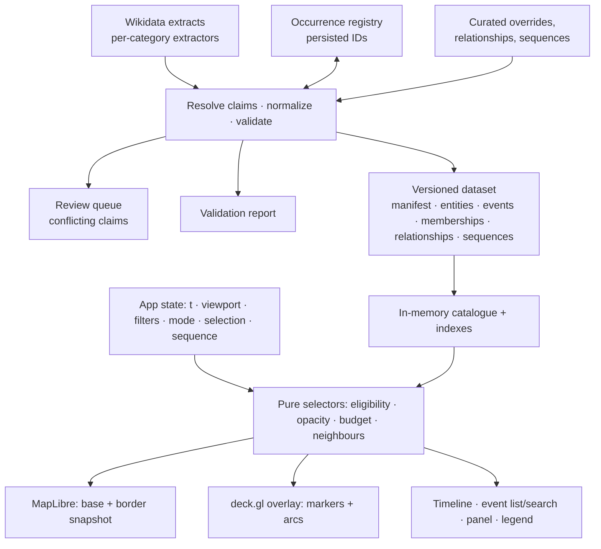

# HistoryMap — Architecture (v0.4)

> Status: **the implementation spec, pending the Milestone 1 audit results.** Revision history is in §0. Reviews are in
> `docs/reviews/`. 🟡 = a default to be tuned from evidence.

## 0. Revision history

**v0.3 → v0.4** (review 2):

| # | Finding | Resolution |
|---|---|---|
| 1 | Occurrence IDs are not stable; multiple statements ≠ multiple occurrences | A persisted **occurrence registry**; statement IDs kept as provenance; an explicit repeated-vs-alternative rule; conflicts go to a review queue (§4.2) |
| 2 | Date rendering is contradictory; mixed calendars; century bounds; "no end ⇒ point" | Four separate notions (possible interval, representative time, reveal rule, fade reference); a **Julian Day** computation axis; `[1101, 1201)`-style half-open bounds; an explicit `temporalKind` including `openSpan` (§4.3) |
| 3 | The budget can be consumed by invisible events | A 5-step selection order; opacity-0 events are excluded before ranking; ID tie-break; bounded selection neighbours; future and filtered context rules; selection and sequence added to the invariant (§8) |
| 4 | Scope and dangling references | The scope governs **events**; a referenced-entity closure; external references for out-of-scope targets; exclusion reasons; validation of subjects, sequences and overrides; a region-evidence rule for unlocated events (§5.1) |
| 5 | Pairwise derived links explode | **Membership indexes** instead of pairwise links; bounded neighbours at selection time; separate `about` vs `involving` indexes (§4.5, §6) |
| 6 | Provenance undefined | A `Provenance` type per field: statement IDs, entity revision, extractor version, override, sources; reproducible build manifest (§4.6, §5.3) |
| 7 | 0.25-year update buckets | rAF-driven playback; ranking throttled separately; a seek evaluates immediately (§9) |
| M | Milestones | The audit is stratified and includes hard cases; M2 adds a searchable event list (§11) |
| S | User direction: gradual development | The design targets the full range, but the **stage window** lives in `config/scope.yaml`; Stage 1 = 901–1099; each stage runs build → test → revise → gate before scaling (§1, §11) |

**v0.2 → v0.3** (review 1): entity/event/relationship split; typed relationships with provenance; full-catalogue
loading; `HistDate`; honest locations; labelled border snapshots; `displayPriority` plus a per-viewport budget;
removed the scaling promises; connected-prototype-first milestones.

**Confirmed defaults:** ghosts off by default (optional *Accumulated history* mode); category-specific
extractor code; an initial budget of 150 ordinary markers; birth↔death as a derived `sameSubject` relation when
both are in scope.

## 1. Goals and scope

| | |
|---|---|
| Purpose | A personal prototype proving **connected exploration**; publishable later |
| Region | Europe + Mediterranean + Anatolia/Levant: lon −25…50, lat 28…72 |
| Time | **Designed for** 476–1453 (and beyond). **The current stage window** is set in `config/scope.yaml`; Stage 1 = `[JD(901-01-01), JD(1100-01-01))`, Julian calendar, i.e. 901–1099 CE inclusive. An event is in scope if its possible interval overlaps the window (§4.3, §5.1) |
| Development | **Staged:** build a small window → test look and function → revise architecture or data → scale the window and data (§11) |
| Categories | War · Life · Architecture · Science & culture · Religion |
| Base map | Natural Earth physical base (no modern labels) + toggleable, labelled border snapshots |
| Connections | On click: bounded arcs + side panel; each link states its type and evidence |
| Stack | Python → versioned static dataset → Vite + TS + MapLibre GL (camera owner) + deck.gl `MapboxOverlay` |

**Non-goals:** accounts, an editing UI, a backend, mobile-first layout, non-English content, causal inference.

## 2. Architecture overview



```
HistoryMap/
├─ docs/            architecture.md · reviews/ · audit/
├─ pipeline/
│  ├─ audit/        Milestone 1 harness (throwaway-labelled)
│  ├─ config/       categories.yaml, regions.yaml
│  ├─ extractors/   war.py life.py architecture.py culture.py religion.py
│  ├─ registry/     occurrences.json   ← committed; the source of stable event IDs
│  ├─ curated/      overrides.yaml relationships.yaml sequences.yaml inclusions.yaml
│  ├─ review/       conflicts.yaml     ← generated queue, resolutions fed back via overrides
│  ├─ fetch.py resolve.py normalize.py scope.py derive.py validate.py build.py
│  └─ tests/
└─ web/src/         data/ state/ select/ map/ ui/   (+ tests/)
```

## 3. Stack notes

- MapLibre owns the camera; deck.gl is attached via `MapboxOverlay` (interleaved). One camera, one picking path.
- A synchronous in-memory catalogue for the prototype. If the data outgrows memory, **migrate deliberately** to an
  async query API (`queryEvents`, `getEvent`, `getRelations`). PMTiles may later serve basemap and borders only.
- No custom shaders until a benchmark shows a need.

## 4. Data model

### 4.1 Entities and events

```ts
type EntityKind = "person" | "building" | "work" | "polity" | "place" | "conflict" | "council" | "other";

interface Entity {
  id: string;                    // QID or "hm:e:<slug>"
  kind: EntityKind;
  label: string;
  wikipedia?: string;
  role: "subject" | "reference"; // reference = included only to interpret retained events (§5.1)
  source: Provenance;
}

interface HistEvent {
  id: string;                    // from the occurrence registry (§4.2); never computed from query order
  eventType: string;             // battle | siege | war | birth | death | built | destroyed | created |
                                 // published | discovered | council | schism | …
  subjectEntity: string;         // the entity the event is ABOUT
  primaryCategory: Category;
  categories: Category[];
  title: string;
  timing: Timing;                // §4.3
  location?: Location;           // §4.4; absent ⇒ never on the map
  displayPriority: number;       // 0..1, prominence only (§8)
  status: "ok" | "sourceMissing" | "needsReview";
  source: Provenance;            // §4.6
}
type Category = "war" | "life" | "architecture" | "culture" | "religion";
```

### 4.2 Occurrence identity and claim resolution

**Registry.** `pipeline/registry/occurrences.json` is committed and append-only:

```json
{ "Q8581:birth":            { "entity": "Q8581", "eventType": "birth",     "statements": ["Q8581-1a2b…"], "created": "2026-09-24" },
  "Q12345:destroyed:k7f3q": { "entity": "Q12345","eventType": "destroyed", "statements": ["Q12345-9c…"],  "created": "2026-09-24" } }
```

- **First occurrence** of `(entity, eventType)` gets `"{qid}:{eventType}"`.
- **Additional distinct occurrences** get `"{qid}:{eventType}:{key}"`, where `key` = the first 5 base32 characters of
  the SHA-1 of the **statement GUID that first evidenced it**. It is minted once, stored, and never recomputed from order.
- Each build **matches** incoming statements to registry entries by statement GUID. An unmatched statement is
  resolved with the rules below; only a *new distinct occurrence* mints a new ID.
- If every statement behind a registered ID disappears, the event stays with `status: "sourceMissing"` (kept in
  the build, flagged in the report). The ID is never reused, so curated links never break silently.

**Repeated occurrence vs. alternative claim.** Multiple values of one property (e.g. two P576 dates) are:

1. **Alternative claims about one event** (the default). The claims are merged into one event, and the chosen claim is:
   the preferred-rank (`BestRank`) claim → the best-sourced (most references) → the narrowest precision. Deprecated claims
   are ignored.
2. **Distinct occurrences**, only when there is positive evidence: distinct `P793 significant event` items each
   with their own date; or series-ordinal (P1545) qualifiers; or an explicit curated entry in
   `curated/overrides.yaml` (`splitOccurrences`).
3. **Conflict → review queue.** If the alternative claims have **non-overlapping possible intervals** and no
   `BestRank` claim decides between them, the event gets `status: "needsReview"`. It uses the widest envelope as its possible
   interval, the conflict is written to `review/conflicts.yaml`, and it's resolved through an override. It is never
   auto-split.

*Test:* reversing statement order or adding a new alternative claim leaves every existing ID unchanged and
leaves curated links resolvable.

### 4.3 Time

**Computation axis:** every date is converted from its **source calendar** to a Julian Day Number (JD). All
comparisons use JD. The timeline axis is the Julian epoch `t = 2000 + (JD − 2451545.0) / 365.25`, which is used **for
positioning and animation only**. It is anchored to Gregorian 2000, so it sits about 13 days off Julian calendar years.
All **boundaries** (scope, filters) are therefore calendar dates converted to JD, e.g. the Stage 1 window is
`[JD(901-01-01 Julian), JD(1100-01-01 Julian))`. The original value, precision and calendar are kept for display
("c. 1150, Julian").

```ts
interface HistDate {
  raw: string;                 // "+1150-00-00T00:00:00Z"
  precision: "day" | "month" | "year" | "decade" | "century" | "millennium";
  calendar: "julian" | "gregorian";
  earliestJd: number;          // INCLUSIVE lower bound
  latestJd: number;            // EXCLUSIVE upper bound — every interval is half-open [earliest, latest)
  circa?: boolean;             // P1480 = Q5727902
  statementId: string;
}
interface Timing {
  temporalKind: "point" | "span" | "openSpan";
  start: HistDate;
  end?: HistDate;              // required for "span"; absent for "point" and "openSpan"
  // openSpan = a known duration with an unknown end (or unknown start); NOT a point event
}
```

Bounds by precision (Wikidata semantics): year Y → `[Y-01-01, (Y+1)-01-01)`; **century C → years
`[100(C−1)+1, 100C+1)`**, i.e. the 12th century = `[1101, 1201)`; decade → `[10k, 10k+10)`. P1319/P1326 qualifiers, when
present, replace the bounds. P4241 (refine date, e.g. "beginning of") narrows them.

**The four notions, defined once:**

| Notion | Definition |
|---|---|
| **Possible interval** | `[start.earliest, (end ?? start).latest)`. Used for scope (§5.1) and shown on selection as an uncertainty bar |
| **Representative time** `rt(d)` | The midpoint of `d`'s bounds, unless a curated override sets it. A display convention, not a claim |
| **Reveal rule** | point → visible from `rt(start)`; span → from `rt(start)` until `rt(end)`; openSpan → from `rt(start)` for a 🟡 default 5 years (styled "end unknown") |
| **Fade reference** `f` | point → `rt(start)`; span → `rt(end)`; openSpan → `rt(start) + 5` |

Uncertain events therefore appear once, at their representative time, styled as uncertain. They **do not** stay
active across their uncertainty interval, which keeps uncertainty and duration apart.

### 4.4 Locations

```ts
interface Location {
  lat: number; lon: number;
  role: "eventSite" | "settlement" | "buildingSite" | "creationPlace";
  precision: "exact" | "settlement" | "region";
  source: Provenance;          // which entity and statement the coordinate came from
}
```

| Category | Chain (first hit wins); none ⇒ unlocated |
|---|---|
| War | event P625 → P276's P625. Wars are spans with members (§4.5); no invented point |
| Life | P19/P20 place's P625 (`settlement`) |
| Architecture | item P625 (`buildingSite`). P571 is shown as "founded / inception" |
| Culture | P1071 location of creation → curated. **No creator-birthplace fallback** |
| Religion | event P625 → P276's P625 |

### 4.5 Memberships and relationships

**Memberships** (grouping facts, stored once per member, **never expanded pairwise**):

```ts
interface Membership { event: string; group: string; kind: "conflict" | "campaign" | "council-series"; source: Provenance; }
```

**Relationships** (binary facts):

```ts
interface Relationship {
  id: string;                          // registry-style stable ID: "{from}>{type}>{to}"
  type: "partOf" | "precedes" | "participant" | "createdBy" | "locatedAt" | "sameSubject" | "influenced" | "ledTo";
  from: Ref; to: Ref;                  // Ref = { kind: "event" | "entity" | "external"; id: string; label?: string; url?: string }
  provenance: "imported" | "derived" | "curated";
  evidence: string;                    // human-readable sentence shown in the panel
  source: Provenance;
}
```

- `sameConflict` / `sameCampaign` are **not stored**. They're derived at selection time from memberships (§6).
- `sameSubject` (e.g. birth↔death) is stored only when both events are retained. It's one link per pair and small.
- `influenced` / `ledTo` are **curated only**, and require `source.sources` URLs plus an explanation.
- Labels are narrow: "Part of the same war", "Followed by (per Wikidata)", never an implied cause.

### 4.6 Provenance

```ts
interface Provenance {
  claims: Array<{
    field: "timing.start" | "timing.end" | "location" | "title" | "membership" | "relationship" | "type";
    entity: string;              // QID the value came from (may differ from the subject, e.g. a birthplace)
    property: string;            // "P569"
    statementId?: string;        // wds GUID
    entityRevision: number;      // schema:version at fetch time
  }>;
  extractor: { name: string; version: string };  // e.g. { "life", "0.3.1" }
  override?: { id: string; reason: string; date: string };
  sources?: string[];            // URLs for curated interpretations
}
```

## 5. Pipeline

### 5.1 Scope policy

- **Events** are retained iff:
  1. the possible interval overlaps the **stage window** from `config/scope.yaml` (Stage 1: `[JD(901-01-01 Julian),
     JD(1100-01-01 Julian))`), **and**
  2. region: the location is inside the bbox; **or** the event is unlocated and has *region evidence*
     (P17 country / P710 participant / P276 place resolving to a polity or place inside `config/regions.yaml`);
     **or** it's listed in `curated/inclusions.yaml`.
- Unlocated events without region evidence are **excluded**, with the reason `unlocated-no-region-evidence`.
- **Entities:** the closure of every entity referenced by retained events (subjects, participants, creators, places,
  groups) is included as `role: "reference"` when it isn't itself a subject. This is one hop only.
- **Event→event links** whose target is not retained become `Ref { kind: "external", label, url }`, with the reason
  (`target-out-of-time-scope`, `target-out-of-region`, `target-excluded:<reason>`). They are never silently dropped.
- **Validation (build fails on):** ID collisions; a dangling `subjectEntity`, membership group, relationship
  ref, sequence step, or override target; a registry entry changing its entity or eventType.

### 5.2 Stages

`fetch` (WDQS: cache, serialized, backoff on `Retry-After`, window splitting on timeout) → `extract` (per
category) → `resolve` (claims + registry, §4.2) → `normalize` (JD, bounds, locations) → merge curated → `scope`
(§5.1) → `derive` (sameSubject, reverse indexes' inputs) → `validate` → `build`.

### 5.3 Reproducibility

- Raw WDQS responses are cached content-addressed under `pipeline/cache/` and never mutated.
- `manifest.json` records: the dataset version; the git commit; the hash of `config/` + `curated/` + `registry/`; each
  extractor's version; the set of cache-entry hashes used; per-source licence, version/commit and retrieval date;
  and the counts.
- **Rebuild guarantee:** the same commit + cache set ⇒ a byte-identical dataset (checked in CI later; manually for now).

### 5.4 Output

`web/public/data/<version>/`: manifest.json · entities.json · events.json · memberships.json ·
relationships.json · sequences.json · details/ (optional, lazy).

## 6. Catalogue and indexes

The full catalogue is loaded before Play is enabled. Indexes:
- `byId`
- `eventsAbout(entity)` (subject)
- **`eventsInvolving(entity)`** (participant / createdBy / locatedAt)
- `membersOf(group)`, `groupsOf(event)`
- `relationsFrom/To(ref)`
- a time-sorted array by `rt(start)`

**Bounded neighbours on selection:**
- Siblings are drawn from `membersOf(groupsOf(e))`, ranked by |Δt| then displayPriority, then ID, up to K = 🟡 12 per
  relation type.
- Stored relationships of each type are capped the same way.
- "Show all N" opens the list in the panel.

Measure and record gzipped size, parse time and heap in M2. Revisit chunking only if the data demands it.

## 7. Map layers

- Physical base: Natural Earth, dark style, no modern labels.
- **Border snapshot:** the latest snapshot ≤ t, **always labelled** "Borders: c. 1400 · Timeline: 1453", described as
  approximate context. Changes happen as a visible step. Stage 1 uses the 900 and 1000 snapshots (at most ~100 years
  stale). Known gaps for later stages: 400→500 and 1400→1492. Polity-ID mapping is later work.
- Markers: deck.gl `ScatterplotLayer`. Arcs: `ArcLayer`, for the selected event's bounded neighbours only.

## 8. Visibility selection (pure, deterministic)

Input state `S = (t, viewport, zoom, filters, mode, selection, sequence)`.

1. **Eligibility:** the category is enabled; `t ≥ rt(start)` (reveal rule, §4.3); the event is located.
2. **Opacity:** full while revealed and active; after `f`, it fades to 0 over `window = lerp(10, 80, displayPriority)` 🟡 years.
   In *Accumulated history* mode the floor is 0.12 instead of 0.
3. **Candidates:** the eligible events that are in the viewport with **opacity > 0**. Everything else is excluded before ranking.
4. **Rank + budget:** sort by `(displayPriority desc, id asc)` and keep the top N (🟡 150, scaled by zoom). The
   remainder make up the "+N more here" list.
5. **Context exceptions** (applied after the budget, not counted against it):
   - The selected event is always drawn, even if faded or out of budget.
   - Its bounded neighbours (§6, ≤ K per type): past ones are drawn with a "context" outline. **Future ones are panel-only**
     with a "jump to" action, and appear on the map only after an explicit time jump. Neighbours in **disabled
     categories** are drawn dashed and greyed, and labelled "filtered".
   - An active **sequence** draws its steps with `rt(start) ≤ t` and the connecting path.

Unlocated events are never drawn. They appear in the event list, search and panels ("location unknown").

**Determinism invariant (tested):** for the same dataset and `S`, the rendered set and styles are identical
regardless of how `S` was reached. There's no accumulated render state.

**displayPriority** 🟡 = the within-category sitelink rank blended with a type prior, plus curated overrides. It
measures prominence only; uncertainty never lowers it.

**Uncertainty styling:**
- Precision coarser than a year, or `circa`: a hollow marker.
- `region` location: a soft, larger marker.
- `needsReview`: a small "?" badge.
- openSpan: an "end unknown" tail on the timeline.
- On selection, the timeline shows the possible interval as an uncertainty bar, separate from any duration span.

## 9. Playback and performance

- The Clock is driven by `requestAnimationFrame`: `t += speed × Δwall`. Opacity is recomputed every frame (the
  prototype has ≤ 300 events in M2).
- The expensive ranking step (step 4) may be throttled (🟡 ≤ 10 Hz) **during play only**. A **seek, pause, filter
  change or viewport end evaluates the full selection immediately**, so the invariant holds at every settled state.
- Benchmarks in M5: frame time at 1/5/25 y/s with borders on and off, for 300 / 10k / full data. GPU filtering is
  considered only if the profile shows CPU attribute generation dominating.

## 10. Acceptance checks

- [ ] Birth and death for one person both exist with distinct IDs.
- [ ] Reordering statements or adding an alternative claim changes no existing ID; curated links still resolve.
- [ ] A removed source statement yields `sourceMissing`, not a renumbered ID.
- [ ] Conflicting non-overlapping claims produce `needsReview` and a queue entry, never two events.
- [ ] Seek-to-X ≡ play-to-X ≡ play-past-and-seek-back-to-X (property test over random X, selections and sequences).
- [ ] 12th-century events have the bounds `[1101, 1201)`; Julian and Gregorian dates compare correctly on the JD axis.
- [ ] Window edges: events anywhere in the last window year (Stage 1: 1099), and spans already underway at the window
      start (Stage 1: 901), are included; changing only `scope.yaml` moves the window without code changes.
- [ ] Budget: faded (opacity 0) or off-screen events never take a slot; equal priorities break ties by ID.
- [ ] Selecting a battle in a 1,000-battle war draws ≤ K sibling arcs; the dataset stores 1,000 memberships, not pairs.
- [ ] `eventsInvolving(polity)` finds battles with that polity as a participant.
- [ ] Every referenced entity resolves; out-of-scope targets are external refs with reasons; the build fails on a dangling ref.
- [ ] Unlocated events without region evidence are excluded with a reason; those with evidence can be found in the list.
- [ ] Border UI always shows the snapshot date next to the timeline date.
- [ ] Rebuilding from the same commit and cache produces a byte-identical dataset.
- [ ] In informal testing, users can explain what a connection means.

## 11. Staged development

Each stage runs the same loop: **build → test (look and function) → revise architecture or data if needed → gate →
next stage.** A stage passes its gate only when its acceptance checks (§10) pass and you're satisfied with the look and
behaviour. Findings are recorded in `docs/audit/stage-N-review.md`, and any spec change bumps this document's version.

### Stage 1: MVP, window 901–1099 CE, all five categories
1. **Data feasibility audit** (stratified): about 40–60 items per category across 4 half-century strata × 6 subregions,
   plus deliberate hard cases (no location, coarse dates, conflicting claims, no relations). Output:
   `docs/audit/feasibility.md` with a go / adjust / drop recommendation per category, and the in-window counts.
2. **Connected prototype:** about 100–300 events (auto-ingested and reviewed, or curated, depending on the audit counts),
   3–5 sequences (🟡 Lechfeld → Otto I 955–962 · the East–West Schism 1054 · Stamford Bridge → Hastings 1066 ·
   Manzikert 1071 · the First Crusade 1096–1099). It includes playback and scrubbing, selection with bounded arcs and explanations,
   uncertainty display, a labelled borders toggle (900/1000 snapshots), and a **searchable event list**. Record load and parse metrics.
3. **Look and interaction test:** does it look as intended? Can users follow a sequence, explain a connection,
   recover a faded event, and tell the event date from the border date?
4. **Revise:** apply the changes to the architecture, data model and entry rules → gate.

### Stage 2: Scale the data within the window
Broad automated ingestion for 901–1099 (registry, review queue, overrides, validation report, reproducible
builds), density and budget tuning, and a timeline histogram. Test → revise → gate.

### Stage 3: Scale the time range
Widen `scope.yaml` step by step (e.g. 801–1200 → 476–1453). Benchmarks (§9), the chunking decision (§6),
the border-gap handling for 400→500 and 1400→1492, and the final aesthetic. Test → revise → gate.

### Later
Wider range (0 CE onward), other regions, other languages, public deployment.

## 12. Licensing and provenance

Recorded per source in `manifest.json` from the first build: Wikidata (CC0), Natural Earth (public domain),
historical-basemaps (commit and licence, to be confirmed before any public release), Wikipedia (links only).
