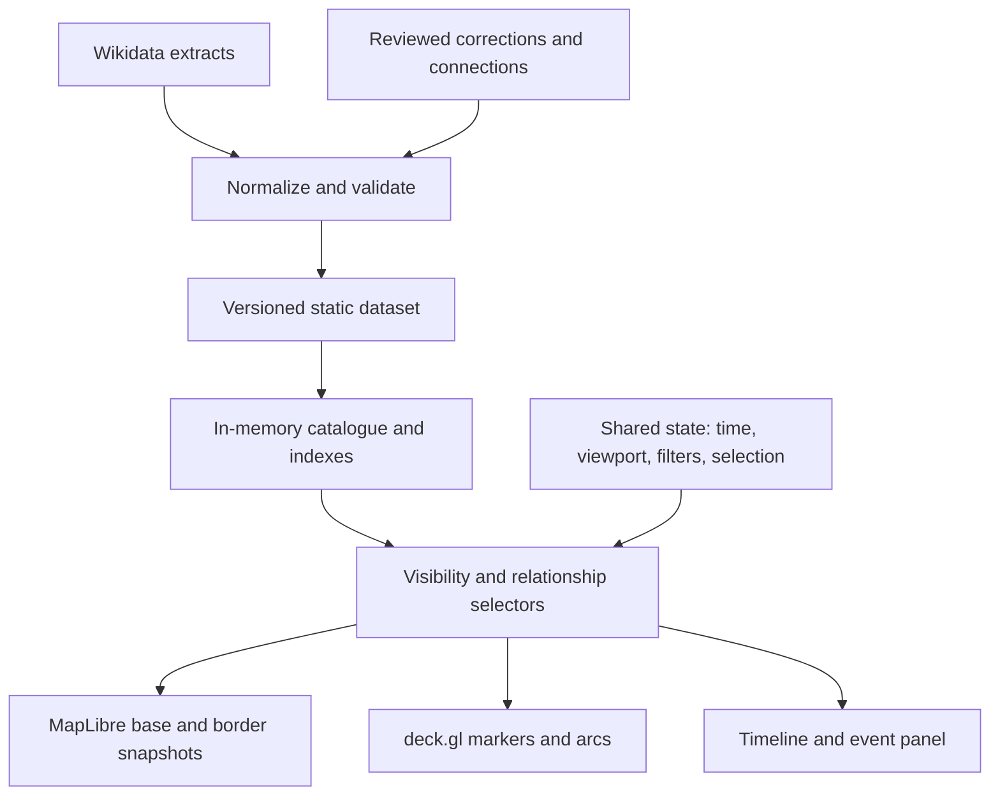

# HistoryMap — Architecture and Plan Review

Reviewed: 24 September 2026  
Source: [HistroyMap arhcitecture and plan.md](<HistroyMap arhcitecture and plan.md>)

**I would keep the overall stack, but revise the architecture before implementation.** The proposal is sensible about infrastructure and too optimistic about the data. Its largest risk is producing an attractive animation of historical dots without proving the central idea: helping people understand connections between events.

I’m treating **476–1453 CE, the proposed region, and all five categories as fixed**. This is a design review supported by checks of the upstream documentation; the event counts, coverage, and performance estimates remain untested.

## 1. Critical: the event identity model would lose records

The event contract (source lines 115–135) uses a Wikidata QID as the event ID, while the build deduplicates by QID. But the same person produces a birth and a death. The same building can produce construction and destruction events.

Those records would collide.

Separate:

- **Entity:** the person, building, work, or political entity.
- **Event:** something that happened involving that entity.
- **Relationship:** a typed connection between events or between an event and an entity.

For example, `Q123:birth` and `Q123:death` could reference the same entity, `Q123`. Repeated construction or destruction needs an additional stable occurrence identifier.

Also allow multiple category memberships with one primary display category. Otherwise an event classified as both military and religious will either be duplicated or arbitrarily lose one classification.

## 2. Critical: the proposed connections do not yet deliver “interconnected history”

The relationship fields (source lines 128–134) mix event IDs with people and political entities. A participant is not necessarily an event with coordinates and a date, so it cannot automatically become an arc endpoint.

There is another missing operation: a battle pointing to its parent war does not automatically provide links to other battles. That requires a reverse index or an explicitly derived relationship.

I recommend a small, explicit relationship model containing:

- Source and target IDs, with their record types.
- Relationship type: `partOf`, `precedes`, `participant`, `sameCampaign`, etc.
- Evidence or an explanation of how the relationship was derived.
- A distinction between imported, derived, and manually curated links.

**Shared participants and chronological sequence do not establish causation.** If an arc means “contributed to,” that interpretation needs supporting evidence. Otherwise label it narrowly.

For the prototype, curate a few connected sequences and explain each connection in a sentence. Arcs alone show association, not historical process. This needs no graph database: JSON records and adjacency indexes are sufficient.

## 3. Critical: the displayed history depends on the user’s navigation path

The loading strategy (source lines 153–154) fetches the playhead’s surrounding centuries and retains everything previously loaded. Meanwhile, significant events persist indefinitely as ghosts.

Consequently:

- Playing from 476 to 1400 accumulates earlier ghost markers.
- Jumping directly to 1400 loads only nearby centuries.
- The same year therefore displays different historical content.

Long-running events create a similar problem: their start-century chunk may sit outside the loading window even while they remain active.

**For the first prototype, load the complete compact event catalogue before enabling playback.** Measure its actual compressed size, parsing time, and memory use. Split heavy descriptions or imagery into separate files if necessary.

If chunking later becomes necessary, loading must account for interval overlap, persistent context, and selected relationships—not just proximity to the playhead.

The key invariant should be:

> Given the same dataset, year, viewport, and filters, the map shows the same result regardless of navigation history.

## 4. High: the date model confuses precision, uncertainty, and duration

A decimal year is useful as a **derived rendering value**. It is insufficient as the canonical historical date.

“Occurred sometime in the twelfth century” and “lasted throughout the twelfth century” are different claims. Assigning both a midpoint or span without preserving their meaning would misrepresent the evidence.

Retain the original date, precision, calendar, and relevant uncertainty bounds separately from an event’s start and end. Wikidata explicitly distinguishes calendar models and uses qualifiers for temporal uncertainty. [Wikidata date documentation](https://www.wikidata.org/wiki/Help:Dates).

There is also a concrete boundary bug in the build filter (source line 184): with decimal years, `year ≤ 1453` excludes dated events after the start of 1453.

Use **`476 ≤ t < 1454`** to include the full agreed range, and an interval-overlap rule for events already underway at its beginning.

For uncertain dates, a midpoint may position a marker, but the interface must not imply that the event definitely happened at that instant.

## 5. High: several extraction rules would create misleading historical geography

The culture fallback (source line 169) places a work at its creator’s birthplace or death place. That does not establish where it was created. An “approximate” ring cannot adequately communicate that distinction.

Similarly:

- A war may span several regions rather than have one meaningful point.
- A birth known to have occurred in a city has city-level precision; it is not necessarily a speculative location.
- A building’s inception date does not necessarily mean construction completion. Wikidata defines P571 broadly as inception or establishment. [P571 definition](https://www.wikidata.org/wiki/Property:P571).

Replace `approxLocation: boolean` with a small location structure describing the **location’s role, precision, and evidence**. Permit an absent location.

Unlocated events can remain available in the timeline and relationship panel. They should not receive invented coordinates just to qualify for the map. Wars can be selectable spans with constituent battles; add regional geometry only when supported.

This also challenges “add categories without code changes.” Configuration can hold query parameters and display settings, but extracting births, buildings, and cultural works requires different interpretation rules.

## 6. High: historical snapshots cannot support apparently continuous political borders

The border rule (source line 195) displays the latest snapshot before the playhead. The upstream index goes from **1400 to 1492**, so this rule shows the 1400 snapshot throughout the remaining prototype period. That follows directly from the dataset and proposed selection rule. [Dataset index](https://raw.githubusercontent.com/aourednik/historical-basemaps/master/index.json).

The issue is more serious than borders “jumping”: users may interpret a decades-old snapshot as the political geography of the displayed event.

Keep the agreed toggle, but:

- Always display the snapshot date separately: “Border reference: 1400; timeline: 1453.”
- Describe borders as approximate historical context.
- Make snapshot changes explicit; cross-fading is a visual transition, not evidence of gradual territorial change.
- Treat mapping polygon labels to political-entity IDs as a separate task.

The dataset itself describes its maps as work in progress requiring verification. [Repository documentation](https://github.com/aourednik/historical-basemaps).

Record the dataset version, provenance, and license during ingestion. The plan’s “licensing matters only when publishing” framing postpones information that is easiest to preserve now.

## 7. Medium: the significance formula does not solve the problems claimed for it

The scoring proposal (source lines 175–180) combines three different concerns: prominence, confidence, and display priority.

Several details need correction:

- **Category percentiles do not balance category volumes.** Keeping the top 30% of 50,000 life events still produces far more markers than the top 30% of 3,000 battles.
- A logarithmic transformation before percentile ranking does not change the ordering.
- Imprecise dating does not make an event historically less significant.
- If scores roughly follow percentiles, the `≥0.3` ghost threshold retains roughly 70% of events indefinitely.

Use a modest `displayPriority` score, separate uncertainty fields, and curated overrides. Add density control for overlapping markers—such as screen-space grouping or a visible-marker budget—and a way to inspect the suppressed events.

Zoom should also reflect **geographic relevance**, not merely global fame. Otherwise a locally significant event may remain hidden when the user is looking directly at its region.

My starting default would be finite fading, with persistent context available through selection and an optional accumulated-history view.

## 8. Medium: the stack is credible; the scaling promises are not

I would retain **Python → static data → Vite/TypeScript → MapLibre + deck.gl**. There is no demonstrated need for a backend.

However, the “JSON → PMTiles → PostGIS with no changes” promise (source line 59) should be removed.

PMTiles stores spatially addressed tiles. It does not inherently provide temporal queries, relationship traversal, or arbitrary event-ID lookup. It could be useful for basemaps or borders without replacing the event store. [PMTiles documentation](https://docs.protomaps.com/pmtiles/).

Likewise, synchronous `byId()` and “everything currently in memory” are not convincing contracts for a future remote service. Either keep a deliberately simple in-memory catalogue now, or later introduce explicit asynchronous retrieval and query operations.

The “25,000 opacities in 1 ms” claim also needs measurement. Rendering includes attribute updates, GPU transfers, picking, borders, and UI work. deck.gl specifically identifies frequent CPU-side attribute generation as a potential animation bottleneck. [deck.gl performance guidance](https://deck.gl/docs/developer-guide/performance).

Choose one map camera owner and use the supported overlay integration. Avoid custom shaders until a measured problem warrants them.

## 9. High: the build sequence postpones the most important experiment

The milestones (source lines 249–259) prove fetching and animating markers before investigating connected exploration.

That proves technical feasibility, but only partially tests the product.

I would replace the sequence with:

1. **Data feasibility audit.** Inspect a small representative sample from every agreed category. Measure usable dates, defensible locations, useful relationships, duplicates, and exclusions.
2. **Curated connected prototype.** Use roughly 100–300 reviewed events spanning the agreed scope, with several richer connected sequences. Include playback, basic scrubbing, selection, relationship explanations, and uncertainty display.
3. **Interaction validation.** Test whether users can follow a sequence, understand why events connect, recover something that faded, and distinguish an event date from a border snapshot date.
4. **Broader automated ingestion.** Expand extraction using the lessons from the reviewed sample. Add overrides, validation reports, caching, retries, and reproducible dataset builds.
5. **Scale and visual refinement.** Benchmark larger datasets, refine density and fading, complete the border overlay, then polish the histogram and aesthetic.

Decade-sized queries are a reasonable experiment, not a guarantee against timeouts. WDQS imposes execution and client limits, including throttling and retry requirements. [WDQS documentation](https://www.mediawiki.org/wiki/Wikidata_Query_Service/User_Manual#Query_limits).

## Recommended architecture

**The revised architecture can remain small.** I would organise it like this:

The dataset needs events, referenced entities, typed relationships, provenance, and a manifest. The shared application state keeps the timeline, filters, selection, and map consistent. These are module boundaries and flat files, not additional services.

## Acceptance checks

Before expanding the dataset, I would require these acceptance checks:

- Birth and death records survive independently.
- Direct seeking and continuous playback produce identical historical content.
- Active spans survive loading and scope boundaries.
- Events throughout 1453 remain included.
- Unlocated events remain discoverable without fabricated map positions.
- Relationship targets resolve even when outside the current time window.
- Users can explain what a connection means after exploring it.

**My recommendation is to approve the technology direction, while requiring revisions to identity, relationships, temporal semantics, loading, and the first milestone.** Those changes are small enough for a prototype and directly determine whether it proves the concept you care about.