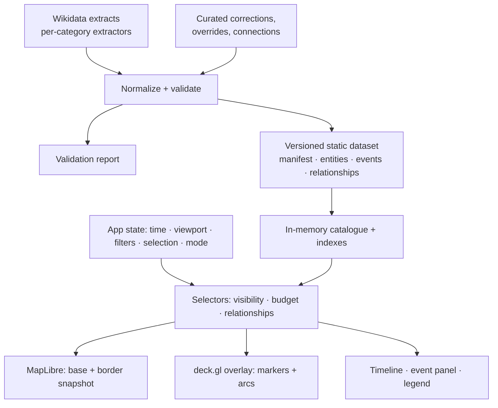

# Plan: HistoryMap — write revised architecture doc (v0.3) for review

## Context

HistoryMap is a new personal-prototype project: an interactive map that plays European history forward
(476–1453 CE) across five event categories, with zoom controlling detail, markers fading over time, and
clickable connections between events. Brainstorming produced a v0.2 architecture. The user reviewed it
(`C:\Users\sidor\.claude\plans\HistoryMap architecture review.md`) and asked for revisions to the identity,
relationship, date, location, loading, significance and milestone models before implementation.

This plan's only action is to create the project folder and write the **revised** doc. No code, scaffolding
or dependencies. The user reviews v0.3; after sign-off it becomes the spec for the writing-plans step.

## Action (after plan approval)

1. Create `C:\Users\sidor\Documents\AI Agents\Projects\HistoryMap\docs\` (the folder exists, empty, and is not a repo).
2. Write `docs/architecture.md` with the **Document content** below, verbatim.
3. Copy the review into `docs/reviews/2026-09-24-architecture-review.md` so the doc's references resolve.
4. `git init`, then commit both files: `docs: add HistoryMap architecture v0.3 and review`.
   **No push:** there's no remote yet. A push waits for the user to name one (or to explicitly approve creating a private GitHub repo).
5. Send `architecture.md` to the user (SendUserFile) and stop for their review.

## Verification

- Both files exist and render as Markdown; the Mermaid block renders in VS Code or GitHub preview.
- `git log --stat` shows one commit containing exactly these two files.

---

## Document content (`docs/architecture.md`)

# HistoryMap — Architecture (v0.3, revised after review)

> Status: **draft for sign-off.** v0.2 was reviewed on 2026-09-24 (`docs/reviews/`). §0 maps every review
> finding to the change it caused. ✅ = agreed decision. ⚠️ = an agreed decision that this revision
> changes, and needs your confirmation.

## 0. What changed from v0.2

| # | Review finding | Change in v0.3 |
|---|---|---|
| 1 | QID-as-event-ID collides (birth/death, built/destroyed) | Separate **Entity / Event / Relationship** records; event IDs such as `Q123:birth`; `categories[]` plus `primaryCategory` (§4.1) |
| 2 | Relationships mix events with people/polities; no reverse links; arcs imply causation | Typed `Relationship` records with provenance (`imported` / `derived` / `curated`) and evidence; built-in reverse indexes; arcs labelled narrowly; causal links only when curated with an explanation (§4.3) |
| 3 | What's shown depends on the navigation path | **Load the full catalogue before playback**; the determinism invariant (§6) |
| 4 | Decimal year conflates precision, uncertainty and duration; the `≤ 1453` bug | A canonical `HistDate` (value, precision, calendar, bounds) kept separate from start/end; the render time is derived; scope is `476 ≤ t < 1454`, using interval overlap (§4.2) |
| 5 | Misleading fallback geography | A `Location` with role, precision and evidence, which may be **absent**; no creator-birthplace fallback; unlocated events stay in the timeline and panel only; per-category extractor code (§4.1, §5) |
| 6 | Snapshots can't support continuous borders | A snapshot date label is always shown; borders are labelled approximate; changes are explicit rather than cross-faded; provenance and license are recorded at ingestion (§7) |
| 7 | Significance conflates prominence, confidence and priority | `displayPriority` only, with uncertainty kept separate; curated overrides; a **per-viewport marker budget** instead of global thresholds; the suppressed count can be inspected (§8) |
| 8 | Overstated scaling promises | The PMTiles/PostGIS drop-in claim is removed; a deliberately simple in-memory catalogue; MapLibre owns the camera with deck.gl `MapboxOverlay`; performance is measured, not assumed (§3, §9) |
| 9 | Milestones postpone the key experiment | A new sequence: data audit → **curated connected prototype** → interaction validation → broad ingestion → scale and polish (§11) |

⚠️ **Decisions this revision changes (please confirm):**
- **Ghosts are off by default.** Markers fade out completely over a significance-weighted window. Persistent
  context comes from the selection (related events stay lit) and from an optional **"Accumulated history"**
  toggle. This replaces the earlier "ghost forever if significance ≥ 0.3".
- **Categories are not "config only".** Config holds queries and display settings; each category also has
  a small extractor module in code, because births, buildings and works need different interpretation rules.

## 1. Goals and scope

| | |
|---|---|
| Purpose | ✅ Personal prototype that proves **connected exploration**, not just animated dots; publishable later |
| Region | ✅ Europe + Mediterranean + Anatolia/Levant: lon −25…50, lat 28…72 |
| Time | ✅ 476–1453 CE, as the half-open interval `[476, 1454)`; extensible |
| Categories | ✅ War · Life (births/deaths) · Architecture · Science & culture · Religion |
| Base map | ✅ Physical base (Natural Earth, no modern labels) + toggleable historical border snapshots |
| Connections | ✅ On click: arcs + side panel; each link says **what kind** of connection it is and **why** |
| Stack | ✅ Python → versioned static dataset → Vite + TypeScript + MapLibre GL + deck.gl. No backend |

**Non-goals:** accounts, editing UI, backend, mobile-first layout, non-English content, causal inference from data.

## 2. Architecture overview



These are module boundaries and flat files, not services.

```
HistoryMap/
├─ docs/                      architecture.md, reviews/, audit/ (data feasibility findings)
├─ pipeline/                  Python
│  ├─ config/categories.yaml  queries, display colors, volume guards
│  ├─ extractors/             war.py, life.py, architecture.py, culture.py, religion.py
│  ├─ curated/                overrides.yaml, relationships.yaml, sequences.yaml (hand-reviewed)
│  ├─ fetch.py                WDQS client: cache, throttling, retry/backoff, Retry-After
│  ├─ normalize.py  validate.py  build.py
│  └─ tests/
└─ web/                       Vite + TypeScript
   ├─ src/data/catalogue.ts   load dataset, build indexes
   ├─ src/state/store.ts      single source of truth for time/viewport/filters/selection
   ├─ src/select/             visibility.ts, budget.ts, relations.ts   (pure functions)
   ├─ src/map/                basemap.ts, borders.ts, overlay.ts (deck.gl MapboxOverlay)
   ├─ src/ui/                 Timeline, EventPanel, Legend, Controls
   └─ tests/
```

## 3. Stack notes

- **Kept:** static data plus MapLibre + deck.gl. No backend is justified at prototype scale.
- **Camera owner:** MapLibre. deck.gl is attached through `MapboxOverlay` (interleaved), so there is one camera
  and one picking path.
- **Scaling, stated honestly:** the prototype uses a synchronous in-memory catalogue. If the data ever outgrows
  memory, we introduce an explicit **async query API** (`queryEvents(timeRange, bbox, filters)`,
  `getEvent(id)`, `getRelations(id)`); that is a deliberate migration, not a drop-in. PMTiles may later
  serve the **basemap and borders** only; it isn't an event store.
- **No custom shaders** until a benchmark shows a problem (§9).

## 4. Data model

### 4.1 Entities and events

```ts
type EntityKind = "person" | "building" | "work" | "polity" | "place" | "war" | "council" | "other";

interface Entity {                 // a thing that exists; not plotted by itself
  id: string;                      // Wikidata QID ("Q8581") or curated ("hm:e:…")
  kind: EntityKind;
  label: string;
  wikipedia?: string;
}

interface HistEvent {              // something that happened; this is what gets plotted
  id: string;                      // `${entityQid}:${eventType}` [+ `:${n}` for repeated occurrences]
                                   // e.g. "Q8581:birth", "Q8581:death", "Q12345:destroyed:2"
  eventType: string;               // battle | siege | war | birth | death | built | destroyed |
                                   // created | published | discovered | council | schism | …
  subjectEntity: string;           // entity this event is about
  primaryCategory: Category;       // drives color
  categories: Category[];          // e.g. a crusade battle: ["war", "religion"]
  title: string;
  start: HistDate;
  end?: HistDate;                  // present ⇒ a real duration ("lasted"); absent ⇒ a point event
  location?: Location;             // may be absent → timeline and panel only, never on the map
  displayPriority: number;         // 0..1, §8
  source: Provenance;
}

type Category = "war" | "life" | "architecture" | "culture" | "religion";
```

Occurrence suffixes (`:2`) come from distinct Wikidata statements (e.g. two P576 statements), which keeps
IDs stable across rebuilds.

### 4.2 Dates

```ts
interface HistDate {
  raw: string;                     // original Wikidata value, e.g. "+1150-00-00T00:00:00Z"
  precision: "day" | "month" | "year" | "decade" | "century" | "millennium";
  calendar: "julian" | "gregorian"; // from the Wikidata calendar model
  earliest: number;                // decimal-year bounds of what the claim allows
  latest: number;                  //   ("12th century" → 1100.0 … 1200.0)
  qualifiers?: { earliest?: string; latest?: string; circa?: boolean }; // P1319 / P1326 / P1480
}
```

- **Uncertainty ≠ duration.** "Sometime in the 12th century" is a `start` with century precision and **no
  `end`**. "Lasted throughout the 12th century" is a `start` + `end`. They render differently (§8).
- **Derived render time** `t = midpoint(earliest, latest)` is computed in the frontend and never stored as the truth.
- **Scope rule:** an event is in scope if its interval `[start.earliest, (end ?? start).latest]` overlaps
  `[476, 1454)`. This includes all of 1453, plus wars already underway in 476.
- Julian dates are kept as they are (the norm for pre-1582 history). No conversion is applied, and the calendar is shown in the panel.

### 4.3 Relationships

```ts
interface Relationship {
  id: string;
  type: "partOf" | "precedes" | "participant" | "sameConflict" | "sameCampaign" | "sameSubject" |
        "createdBy" | "locatedAt" | "influenced" | "ledTo";
  from: { kind: "event" | "entity"; id: string };
  to:   { kind: "event" | "entity"; id: string };
  provenance: "imported" | "derived" | "curated";
  evidence: string;                // "Wikidata P361" | "derived: both partOf Q…" | curator's sentence
  sources?: string[];              // URLs, required when type is influenced/ledTo
}
```

- **Imported:** directly from Wikidata properties (P361, P155/P156, P710, P50/P170, P276).
- **Derived:** computed in the build, e.g. `sameConflict` between two battles that are both `partOf` the same war.
  This is the reverse-index step the review asked for.
- **Curated:** hand-written in `curated/relationships.yaml`. **Only curated links may use `influenced` or
  `ledTo`**, and they must carry an explanation plus a source.
- **Arcs connect events only.** Entity links (participant polity, author) appear in the panel as chips. Clicking
  a chip lists that entity's events, which may then show arcs.
- **Labels are narrow:** "Part of the same war", "Followed by (per Wikidata)", never an implied "caused".
- **Sequences:** `curated/sequences.yaml` defines named, ordered paths (e.g. *The Norman Conquest*, *The Fourth
  Crusade and the Sack of Constantinople*), each step with a one-sentence explanation.

### 4.4 Locations

```ts
interface Location {
  lat: number; lon: number;
  role: "eventSite" | "settlement" | "buildingSite" | "creationPlace";
  precision: "exact" | "settlement" | "region";
  evidence: string;                // "Wikidata P625 on event" | "P19 → Q… P625" | "curated"
}
```

| Category | Where the location comes from (in order); **none ⇒ unlocated** |
|---|---|
| War | Event P625 → P276 place's P625 (precision `settlement` or `region`). **Wars** are selectable spans with constituent battles; regional geometry only when curated |
| Life | P19/P20 place's P625: role `settlement`, precision `settlement` (a known city is not "speculative") |
| Architecture | Item P625 (`buildingSite`, `exact`). `built` from P571 is labelled **"founded / inception"**, not "completed" |
| Culture | P1071 location of creation → curated. **No creator-birthplace fallback** |
| Religion | Event P625 → P276 |

## 5. Pipeline

1. **Fetch:** a WDQS client with an on-disk cache, a descriptive User-Agent, serialized requests,
   exponential backoff that honours `Retry-After`, and automatic window splitting (decade → year) when a query
   times out. Decade windows are a starting guess, not a guarantee.
2. **Extract:** one module per category turns SPARQL rows into Entities, Events and imported Relationships,
   following §4.
3. **Merge curated:** `overrides.yaml` can fix dates or locations, set `displayPriority`, or exclude items;
   `relationships.yaml` and `sequences.yaml` add curated links.
4. **Derive:** reverse indexes and `sameConflict`/`sameCampaign` links.
5. **Validate** and write `docs/audit/validation-report.md`: counts per category, % with usable dates, %
   located (by precision), relationship coverage, duplicates, and exclusions with reasons. The build **fails**
   on dangling relationship targets or ID collisions.
6. **Emit** the versioned dataset:

```
web/public/data/<datasetVersion>/
  manifest.json       version, build time, scope, counts, sources (+ upstream version, license, retrieval date)
  entities.json  events.json  relationships.json  sequences.json
  details/            optional heavy text, loaded on demand when an event is opened
```

## 6. Loading and determinism

- **Prototype:** load the whole compact catalogue (entities, events, relationships) **before enabling Play**,
  then build indexes (`byId`, `bySubject`, `relationsFrom/To`, a time-sorted array).
- **Measure first** in milestone 2 and record the gzipped size, parse time and heap for the audit-sized and
  full datasets. Chunking is revisited only if those numbers demand it. If it is, loading must cover interval
  overlap, active spans, and the targets of the selected event's relationships.
- **Invariant (tested):** *given the same dataset, year, viewport, filters and mode, the map shows the same
  result regardless of navigation history.* Visibility is a pure function of state, with no accumulated render state.

## 7. Map layers

| Layer | Source | Rules |
|---|---|---|
| Physical base | Natural Earth 1:10m land, coast, rivers, lakes (public domain) | Dark custom style; no modern borders or labels |
| Border snapshot (toggle) | aourednik/historical-basemaps (commit hash pinned in the manifest) | Show the latest snapshot ≤ t, but **always label it**: "Borders: c. 1400 · Timeline: 1453". Snapshot changes are a visible step, with no cross-fade. Labelled "approximate historical context" |
| Markers | deck.gl `ScatterplotLayer` | Color = primary category; shape and style by uncertainty (§8) |
| Arcs | deck.gl `ArcLayer` | Selected event ↔ related events only, colored by relationship type |

Known snapshot gaps in scope (verified against the upstream `index.json`): **400 → 500** (476–499 would
show a pre-fall Western Empire) and **1400 → 1492** (1400 is used for all of 1400–1453). The label makes this
visible. Mapping polygon labels to polity entity IDs is a **separate later task**.

## 8. Visibility, density and uncertainty

Per event, given state `(t, viewport, zoom, filters, mode)`:

1. **Active:** the event has started (`t ≥ start.earliest`) and passes the category filters.
2. **Fade:** after it ends (`end` or `start`), opacity falls to 0 over `window = lerp(10, 80, displayPriority)`
   years. In **Accumulated history** mode, faded events stay as faint dots instead.
3. **Selection context:** the selected event and its related events stay visible regardless of fade or
   budget.
4. **Per-viewport budget:** of the active events **inside the current viewport**, show the top N by
   `displayPriority` (🟡 N ≈ 150, adjusted by zoom). Because ranking is per-viewport, a locally important event appears
   when you look at its region, even if it is globally obscure. A **"+312 more here"** control lists the suppressed events.
5. **Unlocated events** appear only in the timeline and panels, marked "location unknown".

**displayPriority** (🟡) = sitelink rank within the category, blended with a type prior (a war outranks a skirmish)
plus curated overrides. It measures **prominence only**: date imprecision never lowers it.

**Uncertainty display:**
- Precision `year` or finer: a solid dot.
- Coarser than a year: a hollow dot, plus an **uncertainty bar** on the timeline spanning `earliest…latest`; the panel shows "c. 1150 (12th century)".
- Location precision `region`: a larger, soft-edged dot.
- Durations (`end` present): the timeline shows a solid span, visually distinct from an uncertainty bar.

## 9. Performance (to be measured, not assumed)

Record in milestone 5: frame time while playing at 25 y/s, with borders on/off, for 1k / 10k / full datasets.
Update opacity via deck.gl `updateTriggers` on the time bucket (e.g. 0.25-year steps), not every frame. Consider
GPU-side filtering (`DataFilterExtension`) only if CPU attribute generation shows up in the profile.

## 10. Testing and acceptance checks

**Unit (pytest / vitest):** date parsing (precision, calendar, bounds, qualifiers); the ID scheme (birth and
death coexist, `:2` occurrences are stable); the location fallback chain (no creator-birthplace); derived
relationships; the scope overlap at 476 and 1453.99; visibility, budget and selection-context selectors.

**Acceptance checks (must pass before broad ingestion):**
- [ ] Birth and death records for the same person both exist and are distinct.
- [ ] Direct seek to year X and continuous play to X produce identical visible sets (property test over random X).
- [ ] Spans active across 476 or across any year boundary stay visible throughout.
- [ ] Events dated anywhere in 1453 are included.
- [ ] Unlocated events can be found via the timeline and panel, with no fabricated coordinates.
- [ ] Relationship targets resolve even when they're outside the current time window.
- [ ] Border UI always shows the snapshot date next to the timeline date.
- [ ] In informal testing, a user can explain what a given connection means after exploring it.

## 11. Milestones

1. **Data feasibility audit:** about 30–50 sampled items per category, fetched with the real extractors. Measure
   usable dates, defensible locations, useful relationships, duplicates and exclusions. Output:
   `docs/audit/feasibility.md`, plus revisions to §4–5 if needed.
2. **Curated connected prototype:** about 100–300 reviewed events across 476–1453 and all five categories,
   with 3–5 curated sequences. Playback, scrubbing, selection, arcs with explanations, uncertainty display,
   and a basic borders toggle with a snapshot label. Record the load and parse metrics.
3. **Interaction validation:** informal sessions (you plus 2–3 others). Can they follow a sequence, explain a
   connection, find a faded event again, and tell the event date from the border date? Findings go in `docs/audit/`.
4. **Broad automated ingestion:** the full pipeline with overrides, validation report, caching, retries and
   reproducible versioned builds.
5. **Scale and refinement:** benchmarks (§9), density tuning, the full borders overlay, the timeline histogram,
   and the final aesthetic (AgeOfEvents / Histography / TimeMap / TimeGlide).

## 12. Licensing and provenance

Recorded in `manifest.json` from the first build: Wikidata (CC0, retrieval date), Natural Earth (public
domain, version), historical-basemaps (commit hash, and license to be confirmed from the repo before any public
release), and Wikipedia (links only).

## 13. Open questions

1. Confirm the two ⚠️ changes in §0: ghosts off by default, and categories needing code.
2. The per-viewport budget: is N ≈ 150 markers a reasonable start?
3. Curated sequences for milestone 2: do you have favourites? (Suggested: Norman Conquest 1066–1087; Fourth
   Crusade 1202–1204; the Great Schism 1054; the rise of the Carolingians 732–814; Fall of Constantinople 1453.)
4. Life events: should the side panel for a birth also offer the same person's death (via `subjectEntity`)
   as a relation? (Proposed: yes, as a derived `sameSubject` link.)
